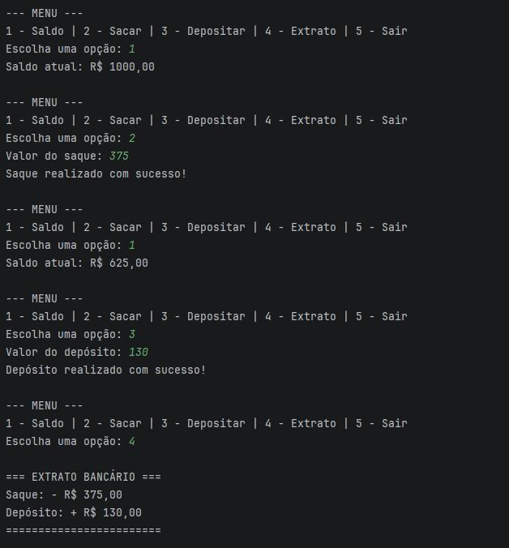

# Simulador de Banco em Java

Projeto simples desenvolvido em **Java**, criado com o objetivo de praticar lógica de programação e conceitos iniciais da linguagem.

Este projeto faz parte dos meus estudos em Java e da minha formação em **Engenharia de Software**.

---

## 🚀 Funcionalidades

- Consultar saldo
- Realizar depósitos
- Realizar saques
- Visualizar extrato de transações
- Menu interativo via terminal

## 🖥️ Exemplo de Execução



---

## 🛠️ Tecnologias Utilizadas

- Java
- IntelliJ IDEA
- Git e GitHub

---

## 📚 Conceitos Praticados

- Estruturas condicionais (`if / else`)
- Estruturas de repetição (`while`)
- Listas (`ArrayList`)
- Entrada de dados com `Scanner`
- Lógica de programação
- Organização de código

---

## ▶️ Como Executar o Projeto

1. Clone o repositório:
   ```bash
   git clone https://github.com/eduardonobilioni-commits/simulador-banco-java.git
